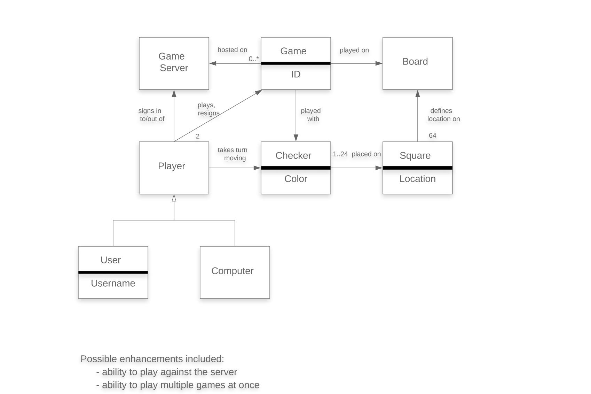
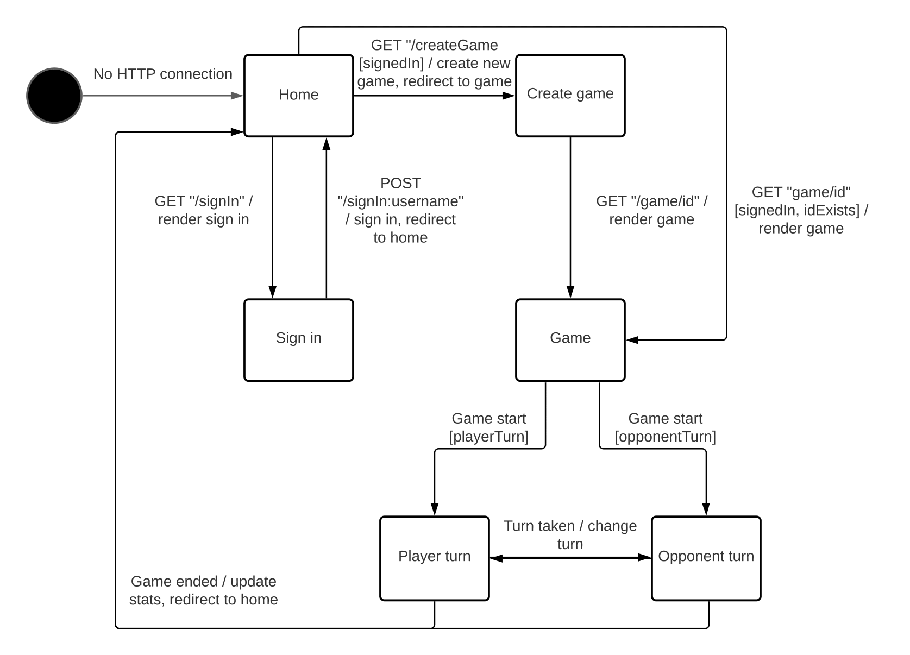
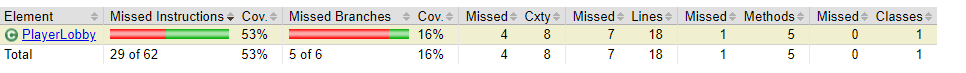
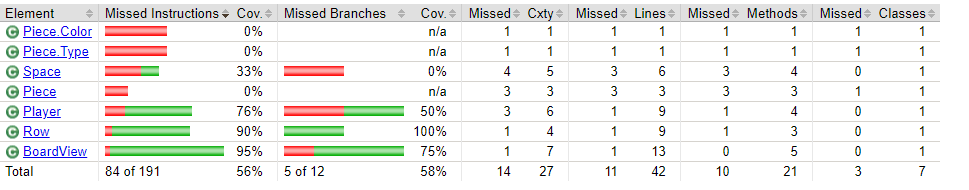
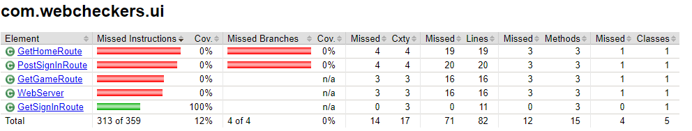

# PROJECT Design Documentation

> _The following template provides the headings for your Design
> Documentation.  As you edit each section make sure you remove these
> commentary 'blockquotes'; the lines that start with a > character
> and appear in the generated PDF in italics._

## Team Information
* Team name: Team A - Tomato
* Team members
  * Zachary Eckhardt
  * Aidan Lynch
  * Klaus Curde
  * Adam Neulight

## Executive Summary

This WebCheckers application utilizes the Java Spark framework. The user goes head to head in a game of checkers
against other signed in users. To get started, the user enters a unique username. Once a username is established they
now ready to play by either selecting or being selected by another user.

### Purpose
> _The purpose of this project is to bring people together to play the game of checkers.
>WebCheckers is meant to be an easy to use application that allows users to choose their 
>challenge whoever they'd like._

### Glossary and Acronyms

| Term | Definition |
|------|------------|
| VO | Value Object |

## Requirements

This section describes the features of the application.

### Definition of MVP
> _The MVP of the project WebCheckers is as follows; allow the player to sign in using a unique username, Play a game of
>American rule set checkers with the opponent of their choice, and then sign out of the game when done._

### MVP Features
> _Players are able to play checkers using the American rule set. This rule set includes simple forward movement, single
>and multiple capture moves, kinging of pieces when they reach the end of the board. The other important features are the
>sign in and out functions, giving players their own unique name._

### Roadmap of Enhancements
> _Multi-game creation: This enhancement allows players join multiple games at the same time. The player can then select
>which game to play in and make moves in._
>
>_Request Hint: This enhancement allows the player to click a button and ask for help._

## Application Domain

This section describes the application domain.

> _Each game being played is on a single board with two players. Each player has the ability to control 12 pieces of
>their assigned color. The pieces are then placed in a pattern on the board composed of 64 squares._

## Architecture and Design

This section describes the application architecture.

### Summary

The following Tiers/Layers model shows a high-level view of the webapp's architecture.

As a web application, the user interacts with the system using a
browser.  The client-side of the UI is composed of HTML pages with
some minimal CSS for styling the page.  There is also some JavaScript
that has been provided to the team by the architect.

The server-side tiers include the UI Tier that is composed of UI Controllers and Views.
Controllers are built using the Spark framework and View are built using the FreeMarker framework.  The Application and Model tiers are built using plain-old Java objects (POJOs).

Details of the components within these tiers are supplied below.

### Overview of User Interface

This section describes the web interface flow; this is how the user views and interacts
with the WebCheckers application.

> _The interface is comprised of a few web pages with the addition of other states that indicate the user's current
>status. The user starts out disconnected (no HTTP connection). Once connected the user is on the home screen, 
>there is then a prompt to sign in, using a username via the sign-in page. A player then awaits game creation by either
>via selecting a user to play against. The red player is then prompted to make a move and waits for the opponent user to
>take their turn. The players swap states depending on whose turn it is. Once a winner is established users are redirected
>back to the home screen._

### UI Tier
> _Provide a summary of the Server-side UI tier of your architecture.
> Describe the types of components in the tier and describe their
> responsibilities.  This should be a narrative description, i.e. it has
> a flow or "story line" that the reader can follow._

> _At appropriate places as part of this narrative provide one or more
> static models (UML class structure or object diagrams) with some
> details such as critical attributes and methods._

> _You must also provide any dynamic models, such as statechart and
> sequence diagrams, as is relevant to a particular aspect of the design
> that you are describing.  For example, in WebCheckers you might create
> a sequence diagram of the `POST /validateMove` HTTP request processing
> or you might show a statechart diagram if the Game component uses a
> state machine to manage the game._

> _If a dynamic model, such as a statechart describes a feature that is
> not mostly in this tier and cuts across multiple tiers, you can
> consider placing the narrative description of that feature in a
> separate section for describing significant features. Place this after
> you describe the design of the three tiers._

### Application Tier
> _Provide a summary of the Application tier of your architecture. This
> section will follow the same instructions that are given for the UI
> Tier above._

### Model Tier
> _Provide a summary of the Application tier of your architecture. This
> section will follow the same instructions that are given for the UI
> Tier above._

### Design Improvements
> _Discuss design improvements that you would make if the project were
> to continue. These improvement should be based on your direct
> analysis of where there are problems in the code base which could be
> addressed with design changes, and describe those suggested design
> improvements. After completion of the Code metrics exercise, you
> will also discuss the resutling metric measurements.  Indicate the
> hot spots the metrics identified in your code base, and your
> suggested design improvements to address those hot spots._

## Testing
> _The current code coverage for the project.
>_

>__

>__

### Acceptance Testing
> _Currently all of the user stories have past the acceptance criteria. The only untested stories are those that
>have not been developed yet. There was not instances of acceptance criteria failing._

### Unit Testing and Code Coverage
> _Discuss your unit testing strategy. Report on the code coverage
> achieved from unit testing of the code base. Discuss the team's
> coverage targets, why you selected those values, and how well your
> code coverage met your targets. If there are any anomalies, discuss
> those._
