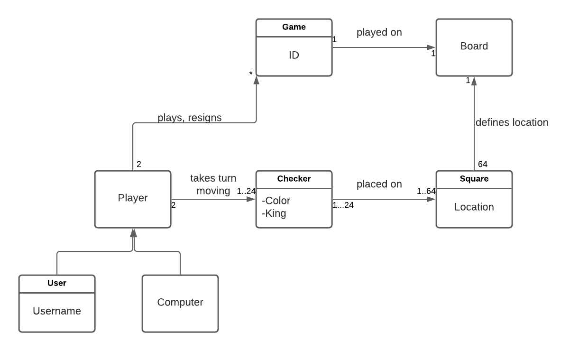

# PROJECT Design Documentation

> _The following template provides the headings for your Design
> Documentation.  As you edit each section make sure you remove these
> commentary 'blockquotes'; the lines that start with a > character
> and appear in the generated PDF in italics._

## Team Information
* Team name: Team A - Tomato
* Team members
  * Zachary Eckhardt
  * Aidan Lynch
  * Klaus Curde
  * Adam Neulight

## Executive Summary

This WebCheckers application utilizes the Java Spark framework. The user goes head to head in a game of checkers
against other signed in users. To get started, the user enters a unique username. Once a username is established they
now ready to play by either selecting or being selected by another user.

### Purpose
> _The purpose of this project is to bring people together to play the game of checkers.
>WebCheckers is meant to be an easy to use application that allows users to choose their 
>challenge whoever they'd like._

### Glossary and Acronyms

| Term | Definition |
|------|------------|
| VO | Value Object |

## Requirements

This section describes the features of the application.

### Definition of MVP
> _The MVP of the project WebCheckers is as follows; allow the player to sign in using a unique username, Play a game of
>American rule set checkers with the opponent of their choice, and then sign out of the game when done._

### MVP Features
> _Players are able to play checkers using the American rule set. This rule set includes simple forward movement, single
>and multiple capture moves, kinging of pieces when they reach the end of the board. The other important features are the
>sign in and out functions, giving players their own unique name._

### Roadmap of Enhancements
> _Spectator mode: Allows the player to join an ongoing game and watch it. The player is not allowed to interact with
>anything on the board._
>

## Application Domain

This section describes the application domain.

> _Each game being played is on a single board with two players. Each player has the ability to control 12 pieces of
>their assigned color. The pieces are then placed in a pattern on the board composed of 64 squares._

## Architecture and Design

This section describes the application architecture.

### Summary

The following Tiers/Layers model shows a high-level view of the webapp's architecture.

As a web application, the user interacts with the system using a
browser.  The client-side of the UI is composed of HTML pages with
some minimal CSS for styling the page.  There is also some JavaScript
that has been provided to the team by the architect.

The server-side tiers include the UI Tier that is composed of UI Controllers and Views.
Controllers are built using the Spark framework and View are built using the FreeMarker framework.  The Application and Model tiers are built using plain-old Java objects (POJOs).

Details of the components within these tiers are supplied below.

### Overview of User Interface

This section describes the web interface flow; this is how the user views and interacts
with the WebCheckers application.

> _The interface consists of a few web pages with the addition of other states that indicate the user's current
>status. The user starts out disconnected (no HTTP connection). Once connected the user is on the home screen, 
>there is then a prompt to sign in, using a username via the sign-in page. A player then awaits game creation by either
>via selecting a user to play against. The red player is then prompted to make a move and waits for the opponent user to
>take their turn. The players swap states depending on whose turn it is. Once a winner is established users are redirected
>back to the home screen._

### UI Tier
> _The UI tier classes were given the responsibility of handling HTTP requests. The users were given the ability to sign
>in and out of the service whenever they so chose to do so. Once logged in the user had the opportunity to either 
>challenge another player to a game or spectate an ongoing game. The UI tier also handled the page refreshing to update
>which player's turn it was as well as moves made. The players were given the ability to undo moves in the 
>PostBackupMoveRoute as well as submit moves using PostSubmitMoveRoute. The players were given the opportunity to resign
>which the UI tier handles removing the game was well as returning players to the Lobby._

### Application Tier
> _The Application tier includes the GameCenter and PlayerLobby classes. When the application is first started
>both classes are instantiated. The player lobby holds all the new players that log into the game. PlayerLobby also
>handles the username validation. GameCenter contains all the ongoing games._

### Model Tier
> _The model tier handles all the game logic. It has a game class that keeps track of the unique details about
>the game. The game also keeps track of which player's turn it currently is. The Board class contains the beef
>of the move validation. Whenever a piece is placed on the board, the board class determines from a multitude of 
>variables whether the move is valid. Each space of the board is covered by the Space class which goes into the Row
>class to make up the board. The pieces are then kept by the piece class which helps the board validate moves, as
>well as keeps track of the state of the piece, i.e color and single or king._
>

### Design Improvements
> _If the project were to continue the first improvement to be made would be to move the move validation logic to the 
>game class instead of the board class to adhere to programming design principles better. The next improvement that 
>would be made would be to simplify the move validation so that it isn't a wall of text as well, so it can be unit tested
>easier. The final improvement that would be made would be to better handle the winning and resigning mechanics rather
>than just removing the player from the game._

## Testing
> _The current code coverage for the project.
>_

### Acceptance Testing
> _All the acceptance testing has passed and any failures have been fixed._

### Unit Testing and Code Coverage
> _Our unit testing strategy was to get as much code coverage as possible. This was made difficult in the Board class 
>found in the Model tier because of the move validation logic. The validation methods were impossibly hard to test
>without writing out an absurd amount of setup code. The UI tier tests were also a weak point for us because we couldn't 
>figure out how properly test all the necessary components. The result of these difficulties was a %50 code coverage._
